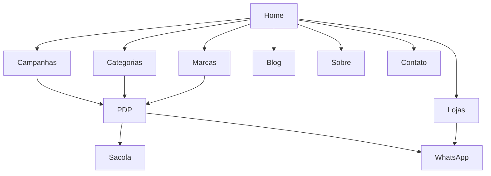

# Reconstrução estratégica do site da Igabeleza

## Resumo executivo

A presença pública hoje indica que a Igabeleza já opera como marca de alto volume e forte capilaridade regional: o perfil do Instagram aparece com cerca de 64 mil seguidores, mais de 5,5 mil posts e a assinatura “O shopping da sua beleza”, enquanto o Linktree reúne canais de ofertas e contatos de lojas em Barreiras, Super Igabeleza, Ibotirama, Luís Eduardo Magalhães, Bom Jesus da Lapa e Guanambi. Ao mesmo tempo, nas buscas públicas realizadas, a presença digital encontrada com maior clareza foi Instagram, Facebook, Linktree e guias locais, sem um e-commerce proprietário facilmente identificável — o que sugere uma oportunidade real de construir um site como hub principal de marca, catálogo, conteúdo e conversão. citeturn0search0turn16view0turn15search3turn15search7

Os sinais públicos do conteúdo da marca apontam para quatro forças que o novo site precisa traduzir: grande variedade de sortimento, vocação promocional forte, operação multiloja com WhatsApp/localidade e linguagem popular/regional que aproxima a marca da comunidade. Isso aparece em snippets públicos sobre “Operação Fecha Mês”, inauguração de loja, delivery, campanhas de maquiagem, contratação de equipe e discursos de variedade em cabelo, maquiagem, skincare e perfumaria. citeturn4search0turn4search2turn4search5turn6search1turn6search6turn6search24

Minha recomendação analítica é trabalhar com **dois sistemas visuais complementares**, não concorrentes. O **Layout A** usa a lógica editorial clean e premium do screenshot enviado, ideal para reposicionamento, campanhas, curadoria e percepção de valor. O **Layout B** traduz melhor a energia social-commerce da marca observada nas redes, com mais blocos de oferta, prova social, feed e atalhos rápidos para conversão local. Em termos de produto digital, a solução mais madura tende a ser um híbrido: **estrutura-base do Layout A + módulos promocionais e sociais do Layout B**. Essa combinação preserva branding e melhora vendas. citeturn4search0turn8search3turn16view0turn15search11

## Método e limitações

Este relatório foi construído a partir de quatro fontes principais: a captura de tela enviada por você, os snippets públicos do Instagram da marca encontrados via busca, o Linktree oficial, a página pública do Facebook e benchmarks de e-commerce/beauty brasileiros. Há uma limitação importante: a abertura direta de páginas do Instagram retornou bloqueio e throttling em diferentes tentativas, então a leitura do Instagram foi feita a partir de bio, snippets públicos de posts/reels e ativos correlatos públicos. Por isso, a análise visual do feed deve ser lida como **aproximação orientada por evidência pública**, não como auditoria exaustiva do grid completo. citeturn1view0turn1view2turn0search0turn16view0

Mesmo com essa limitação, há sinais suficientemente consistentes para orientar o projeto: slogan estável, foco em sortimento amplo, comunicação de promoção, presença local em várias cidades, uso de canais de WhatsApp, anúncios de inauguração e conteúdo recorrente ligado a cabelo, maquiagem, skincare e perfumaria. Isso já é base suficiente para definir arquitetura de informação, proposta visual, hierarquia comercial e direção de copy. citeturn8search3turn16view0turn4search5turn8search14turn15search11

## Leitura da presença atual da marca

### O que o Instagram e os canais públicos comunicam hoje

A marca se apresenta como um destino de beleza amplo e acessível, não como uma boutique nichada. A bio pública disponível em buscas reforça “O shopping da sua beleza”, enquanto os snippets de posts e reels falam de preço, variedade, campanhas de fechamento de mês, lançamentos, maquiagem, cabelo, skincare, delivery e expansão local. Essa combinação posiciona a marca mais perto de um **ecossistema de beleza de conveniência + descoberta + oferta** do que de uma marca monolinha ou de cosmético autoral. citeturn8search3turn4search0turn4search5turn15search11

O tom de voz observado é **caloroso, urgente, próximo e varejista**, com forte presença de chamadas promocionais e linguagem oralizada. Termos como “Alô Santa Luzia!!”, “Começou a Operação Fecha Mês” e “É a chance perfeita” sugerem uma comunicação orientada a movimento, proximidade regional e gatilho de ação rápida. Esse é um ponto central: o futuro site não deve soar frio, corporativo ou excessivamente “luxo distante”; ele precisa equilibrar beleza aspiracional com energia comercial real. citeturn4search0turn6search23turn8search8

Há também um eixo comunitário importante. Os snippets mostram inaugurações, presença em cidades específicas, contratação de vendedora com foco em maquiagem, canais por loja e integração com delivery/WhatsApp. Isso indica que o site deve tratar **lojas físicas e atendimento local** como parte do produto digital, e não como rodapé secundário. citeturn16view0turn6search24turn15search11

### Paleta visual observada e tipografia aproximada

Como o feed completo não pôde ser carregado integralmente, separei a leitura em duas camadas: **cores observadas** nos ativos públicos acessíveis e **cores propostas** para a IDV do site.

Nos ativos públicos observáveis, o núcleo cromático da marca aponta para um **vermelho quente de varejo**, sustentado por branco, vinho/escuro e neutros quentes. A fachada pública da loja em Ibotirama mostra vermelho intenso com wordmark branco, e o avatar exibido no Linktree traz um “i” branco sobre esfera vermelha/vinho com logotipo em vermelho escuro. Isso sugere que o vermelho é o capital visual mais reconhecível da marca e não deve ser abandonado. citeturn12image0turn14image1

| Camada | Cor | HEX aproximado | Leitura |
|---|---:|---:|---|
| Observada | Vermelho Iga | `#D93A32` | cor-mãe de marca, varejo, campanha |
| Observada | Vinho profundo | `#8A1F1C` | profundidade, contraste, títulos escuros |
| Observada | Off-white | `#F7F4F1` | respiro, fundo limpo |
| Observada | Bege quente | `#D9C4B8` | apoio editorial e beleza |
| Observada | Café escuro | `#2A1D1B` | texto principal e contraste |

Na camada tipográfica, os sinais públicos sugerem um contraste interessante entre uma assinatura com vocação mais clássica e uma comunicação comercial direta. O avatar/Linktree expõe um logotipo que remete a serif itálica clássica, enquanto a operação de oferta e varejo pede uma sans contemporânea para UI, preço, filtros e banners. Para reproduzir esse efeito no site sem depender de fonte proprietária, a dupla mais consistente é **Cormorant Garamond** ou **Fraunces** para títulos/assinatura, combinada com **Manrope** ou **DM Sans** para interface e corpo de texto. Essas fontes são open source no Google Fonts. citeturn14image1turn9search1turn9search3turn9search0turn9search2

### Padrões de composição, iconografia e elementos de marca

A composição de conteúdo observável nas redes é menos “packshot minimalista contínuo” e mais “mix de vitrines”: campanhas, sorteio/oferta, inauguração, variedade, maquiagem inspiracional, produto em demonstração, serviço local e prova de proximidade. Em termos de site, isso pede uma arquitetura visual que suporte tanto campanhas editoriais quanto blocos promocionais de rápida atualização. citeturn4search0turn4search1turn4search2turn6search1turn8search14

A iconografia da marca, a partir dos snippets públicos, tende a orbitar brilho, urgência e beleza comercial: sparkle, batom, alto-falante/comunicado, corações e shopping/carrinho. Eu recomendaria converter isso em um sistema de ícones de linha simples com cantos levemente arredondados, evitando pictogramas frios demais. Assim, o site conversa com a linguagem social sem ficar “carregado” como arte de feed. citeturn0search0turn4search0turn6search24

Uma leitura importante de branding: o discurso público da Igabeleza combina **variedade + preço + proximidade + autoestima**. Isso significa que o site precisa trabalhar com fotografia humana e não apenas com embalagem. Benchmarks brasileiros bem-sucedidos reforçam, cada um à sua maneira, esse casamento entre produto, conteúdo e experiência: a Sallve enfatiza comunidade e ciência; a Simple Organic organiza discurso de clean beauty e propósito; a Creamy simplifica jornada por rotina; a Océane opera catálogo amplo com foco em conveniência; a Beleza na Web mostra a força de um varejo extenso e orientado a categorias. citeturn18search0turn17search15turn20search0turn17search1turn15search10

## Identidade visual proposta

### Direção conceitual

A identidade visual derivada do que está público hoje deve preservar o vermelho reconhecível da marca, mas refiná-lo dentro de um sistema mais organizado e confiável para web. Em vez de um site inteiramente vermelho, a proposta ideal é construir uma **marca com núcleo vermelho e ambiente de navegação sofisticado**, usando fundos claros, tipografia escura, apoio blush/bege e fotografias luminosas. Isso permite dialogar com o varejo e com o editorial ao mesmo tempo. citeturn12image0turn14image1turn17search15turn18search0

### Paleta principal e secundária

#### Paleta principal da IDV

| Papel | Cor | HEX | Uso |
|---|---:|---:|---|
| Marca principal | Vermelho Iga | `#D93A32` | assinatura, badges, destaques de campanha |
| CTA acessível | Vermelho profundo | `#B42824` | botões com texto branco |
| Título escuro | Vinho | `#8A1F1C` | títulos, links fortes, hover elegante |
| Texto base | Café | `#261611` | body text, formulários, menu |
| Fundo principal | Off-white quente | `#FFF8F6` | fundo geral |
| Fundo editorial | Blush suave | `#F4D8D6` | faixas e seções de emoção |

#### Paleta secundária

| Papel | Cor | HEX | Uso |
|---|---:|---:|---|
| Bege nude | `#E7C5B4` | cards editoriais |
| Areia | `#D5B195` | fundos de categoria |
| Rosa cosmético | `#E8A9A7` | selos e microdestaques |
| Cinza quente | `#8A7774` | textos de apoio |
| Branco puro | `#FFFFFF` | sobreposição, contrastes, botões em fundo escuro |

A recomendação de contraste é simples: **texto corrido em tons escuros sobre fundos claros**; vermelho vivo fica melhor como acento, selo ou botão grande. As diretrizes WCAG 2.2 exigem, em regra, contraste mínimo de 4,5:1 para texto normal e 3:1 para indicadores/focos visíveis, então o body copy deve usar café ou vinho escuro, não o vermelho vivo principal. citeturn10search4turn10search12

### Tipografia recomendada

#### Pairing recomendado

| Função | Preferência | Alternativa | Fallback web-safe |
|---|---|---|---|
| Display / hero / headings | Fraunces | Cormorant Garamond | Georgia, serif |
| UI / menu / botões / cards | Manrope | DM Sans | Arial, Helvetica, sans-serif |
| Editorial longo / blog | Cormorant Garamond para títulos + Manrope para corpo | Fraunces + DM Sans | Georgia + Arial |

**Justificativa:** Fraunces e Cormorant Garamond trazem o peso cultural de beleza/editorial; Manrope e DM Sans resolvem legibilidade, grid e e-commerce. As quatro famílias são open source e amplamente distribuídas para uso web. citeturn9search3turn9search1turn9search0turn9search2

#### Escala tipográfica sugerida

| Elemento | Desktop | Mobile |
|---|---:|---:|
| Hero H1 | 64–80 px | 36–44 px |
| H2 | 40–52 px | 28–34 px |
| H3 | 28–34 px | 22–26 px |
| Texto base | 18–20 px | 16–18 px |
| Microcopy | 14–16 px | 14–16 px |
| Botões | 16–18 px | 15–16 px |

### Estilo de imagem e diretrizes de uso

A linguagem fotográfica deve ser composta por três famílias: **beleza humana real**, **produto em fundo limpo** e **contexto de loja/comunidade**. Essa divisão conversa com o discurso público da marca, que mistura sortimento, proximidade regional e desejo de consumo. O ideal é que a home nunca mostre apenas produto isolado; ela precisa alternar rosto, textura, coleção e prova social. citeturn4search1turn4search2turn15search11turn16view0

Diretrizes operacionais:

| Dimensão | Diretriz |
|---|---|
| Tratamento | luz quente, pele real, saturação moderada, fundo claro |
| Enquadramento | 70% close/medium shot, 30% packshot |
| Textura | valorizar brilho de pele, pigmento, pincel, frasco, antes/depois leve |
| UGC | incluir feed real e reviews, mas com moldura/curadoria |
| Loja física | usar em “Lojas” e “Sobre”, não como visual dominante do hero |

## Layout A

### Conceito

O Layout A parte da lógica do screenshot enviado: composição arejada, editorial, limpa, com hero generoso, serif elegante, cards amplos e blocos de produtos que parecem vitrine premium. Ele funciona melhor para elevar percepção de marca, organizar história, valorizar categorias e dar sensação de curadoria. É o layout certo se o objetivo principal for **reposicionar o digital da Igabeleza como marca forte e confiável**, sem abrir mão da venda. A referência conceitual aproxima essa direção de marcas que articulam propósito, vitrine e conteúdo, como Simple Organic e, em outra chave, Sallve. citeturn17search15turn18search0

### Mockups conceituais

**Desktop**

**Mobile**

### Estrutura de páginas e hierarquia

#### Home

| Bloco | Hierarquia | Conteúdo |
|---|---|---|
| Header | alta | logo, menu, busca, conta, carrinho, WhatsApp |
| Hero editorial | máxima | campanha principal + subtítulo + 2 CTAs |
| Faixa de diferenciais | alta | curadoria, marcas, retirada, entrega |
| Seção “A abordagem Igabeleza” | alta | 3 cards: maquiagem, cabelo, skincare |
| Essenciais da semana | alta | 4–8 produtos com selo e preço |
| Bloco humano/editorial | média | imagem de campanha + manifesto curto |
| Feed curado / comunidade | média | 3 cards com UGC/review |
| Marcas / confiança | média | logos de marcas parceiras |
| Footer | alta | lojas, horários, WhatsApp, newsletter, política |

#### Shop

| Bloco | Conteúdo |
|---|---|
| Hero curto | campanha ou categoria em destaque |
| Navegação lateral/filtros | categoria, marca, faixa de preço, tipo, benefício |
| Grid | 16–24 produtos por página |
| Ordenação | relevância, lançamentos, menor preço, mais vendidos |
| Apoio | FAQ de entrega/retirada, CTA WhatsApp |

#### About

Manifesto da marca, história, presença regional, fotos reais das lojas, compromisso com atendimento e variedade.

#### Contato

Mapa por cidade, horários, botões de WhatsApp por unidade, formulário simples, FAQ de trocas/retirada.

#### Blog

Editorial de beleza utilitária: dicas, tendências, lançamentos, rotinas, guias por categoria.

### Componentes, cores, tipografia, espaçamento e responsividade

| Componente | Especificação |
|---|---|
| Hero | fundo `#F9F0E6` / `#E7C5B4`, título em serif, CTA terracota escuro |
| Cards de categoria | 3 colunas desktop, 1 coluna mobile |
| Produto | cards altos com imagem grande, título, preço, selo, nota opcional |
| Feed UGC | 3 cards estilo “post” sem simular Instagram literalmente |
| CTA | primário em `#B42824`, secundário outline em vinho |
| Grid desktop | container 1280 px, 12 colunas, gutter 24 px |
| Grid mobile | 4 colunas fluidas, gutter 16 px |
| Espaçamentos | seções 96–128 px desktop; 56–72 px mobile |
| Breakpoints propostos | 360, 768, 1024, 1440 |

Em responsividade, o Layout A deve **empilhar, não comprimir**. A leitura precisa continuar editorial no mobile, com hero em duas etapas: texto primeiro, imagem depois. Esse comportamento está alinhado às boas práticas de responsive design e media queries descritas pela MDN, bem como ao uso correto de viewport. citeturn10search19turn10search15turn10search7

### Quando o Layout A é mais forte

O Layout A é superior quando a decisão estratégica é: aumentar confiança, parecer maior e mais organizada, vender curadoria e construir valor percebido para além do desconto. Em marcas de beleza, isso costuma melhorar taxa de permanência, leitura de campanha e consumo de conteúdo, especialmente quando a marca quer parecer mais “marca própria de experiência” e menos “encarte de oferta”. Benchmarks brasileiros de clean beauty e skincare mostram a força dessa combinação entre conteúdo, propósito e vitrine. citeturn17search15turn18search0turn20search0

## Layout B

### Conceito

O Layout B traduz com mais fidelidade a energia social-commerce observada na presença pública da Igabeleza. Ele se apoia em blocos de feed, stories/categorias, oferta, marcas, UGC, atalhos de loja e CTA de WhatsApp. É o layout ideal quando a meta principal é **aumentar conversão de tráfego vindo do Instagram, campanhas e WhatsApp**, sem exigir do usuário uma navegação longa para chegar a produto, loja ou promoção. Essa lógica conversa com o comportamento observado da marca nas redes: comunicação quente, muita campanha, linguagem próxima e forte conexão com oferta. citeturn4search0turn6search1turn15search11

### Mockups conceituais

**Desktop**

**Mobile**

### Estrutura de páginas e hierarquia

#### Home

| Bloco | Hierarquia | Conteúdo |
|---|---|---|
| Header compacto | alta | logo, menu, busca, carrinho, WhatsApp |
| Hero social-commerce | máxima | oferta/manifesto + CTA compra + CTA WhatsApp |
| Stories de categoria | alta | promoções, maquiagem, cabelo, skincare, lojas |
| Vitrine de oferta | alta | campanha flash, cupom, kits |
| Feed da comunidade | alta | reviews, reels destacados, criadores/cliente |
| Marcas queridinhas | média | logos e atalhos |
| Produtos em carrossel | alta | best sellers e lançamentos |
| CTA para lojas | alta | unidade mais próxima + horários |
| Footer amplificado | alta | FAQ, canais, newsletter, políticas |

#### Shop

Grade mais comercial, com filtros rápidos em chips, sticky actions, preços visíveis cedo e blocos de oferta intercalados.

#### About

Mais curto e visual: história, presença regional, fotos de time/lojas, diferenciais.

#### Contato

Quase um hub operacional: escolha sua cidade, fale no WhatsApp, veja horário, solicite ajuda.

#### Blog

Blog utilitário e SEO-first, com conteúdo que nasce do FAQ real de loja e do repertório de busca: cabelo, maquiagem, skincare, perfumes, presentes, promoções sazonais.

### Componentes, cores, tipografia, espaçamento e responsividade

| Componente | Especificação |
|---|---|
| Hero | bloco blush `#F4D8D6` com CTA em vermelho profundo |
| Stories / chips | pills arredondadas com labels curtas |
| Oferta flash | cards de alto contraste e badges de desconto |
| Feed grid | 2–3 colunas mobile/desktop modular |
| Produto | cards mais compactos que no Layout A |
| CTA loja | sticky no mobile após scroll inicial |
| Espaçamento | seções 72–96 px desktop; 40–56 px mobile |
| Narrativa | mais rápida, fragmentada e orientada à ação |

Em mobile, o Layout B performa especialmente bem porque replica padrões que o usuário já reconhece do ambiente social: blocos curtos, atalhos visuais, oferta evidente e caminho rápido para WhatsApp. Isso é coerente com o caráter mobile-first do varejo digital contemporâneo e com o fato de a marca já operar publicamente com múltiplos canais de WhatsApp por loja. citeturn16view0turn15search11turn10search11

### Quando o Layout B é mais forte

O Layout B é melhor quando a marca quer aproveitar a própria tração social para vender com fricção mínima. Como a Igabeleza publica muitos conteúdos, opera promoções e ativa digitalmente diferentes lojas, o B tende a converter melhor tráfego de rede social, campanhas sazonais e usuários que querem “ver logo a oferta”. Ele também é mais simples de manter para times de marketing que atualizam banners, cards e campanhas com frequência alta. citeturn4search0turn6search1turn16view0

## Implementação, assets e governança

### Comparativo de UX entre os dois layouts

| Critério | Layout A | Layout B | Melhor uso |
|---|---|---|---|
| Percepção de marca | mais premium/editorial | mais varejo social | A para reposicionamento |
| Conversão rápida | média-alta | muito alta | B para campanhas |
| Clareza para lojas físicas | boa | excelente | B |
| Curadoria e storytelling | excelente | boa | A |
| Escalabilidade de promoções | moderada | alta | B |
| Blog e SEO | excelente | boa | A |
| Afinidade com Instagram | média | muito alta | B |
| Potencial híbrido | base visual | módulos comerciais | A + B juntos |

Minha síntese: se houvesse apenas um lançamento inicial, eu escolheria **Layout A como base estrutural** e injeta ria no homepage e no shop três módulos do **Layout B**: stories de categoria, bloco de oferta flash e CTA sticky de loja/WhatsApp. Isso cria um site mais nobre sem perder a pulsação comercial que a presença pública da marca já construiu. citeturn4search0turn8search3turn16view0

### Fluxo de navegação recomendado

### Assets a exportar

| Asset | Formato | Tamanho recomendado | Observação |
|---|---|---:|---|
| Logo principal | SVG + PNG | variável / 2000 px | versão clara e escura |
| Símbolo/favicon | SVG + PNG + ICO | 512, 192, 32, 16 | app/web/favicon |
| Hero desktop | WebP | 2400×1600 | até 300–500 KB ideal |
| Hero mobile | WebP | 1080×1350 | crop específico |
| Cards de categoria | WebP | 1200×1200 | 1:1 |
| Banners de campanha | WebP | 1920×800 e 1080×1350 | desktop e social/mobile |
| Thumb de produto | WebP | 1200×1200 | padronizar packshot |
| UGC/reviews | WebP/JPG | 1080×1350 | moderar compressão |
| OG image | PNG/WebP | 1200×630 | SEO/social share |
| Ícones | SVG | variável | sistema único |
| Marca das lojas | SVG/PNG | variável | quando necessário por unidade |

### Guia de implementação front-end

#### Stack sugerida

Se o projeto entrar direto como e-commerce maduro com catálogo, filtros, CMS e expansão, **Next.js** é uma escolha forte porque oferece rendering flexível, navegação otimizada e otimização nativa de imagens via componente `Image`. Se a fase inicial for um site institucional/comercial com catálogo leve, blog forte e integração mais simples, **Astro** funciona muito bem pela excelente entrega de performance e ferramentas nativas para imagens e conteúdo estático. Se a prioridade for comércio headless acelerado sobre infraestrutura Shopify, o **Hydrogen** é o caminho oficial da plataforma para storefront headless. citeturn11search9turn11search0turn11search4turn11search1turn11search5

#### Arquitetura recomendada

| Cenário | Stack |
|---|---|
| MVP institucional + social commerce | Astro + CMS headless + WhatsApp + catálogo leve |
| Site completo de marca + blog + catálogo custom | Next.js + CMS headless |
| E-commerce robusto com checkout de plataforma | Shopify + Hydrogen ou storefront tradicional |

#### Boas práticas técnicas mínimas

Use HTML semântico com `header`, `main`, `nav`, `section`, `article`, `footer`; tokens de design via CSS custom properties; estratégia mobile-first; imagens responsivas em WebP; lazy loading; e componentes reutilizáveis de card, CTA, banner, accordion, store-card, review-card e product-card. Next.js e Astro possuem documentação oficial específica para otimização de imagens e múltiplos formatos responsivos. citeturn11search0turn11search4turn11search10

### Acessibilidade e SEO básico

As diretrizes mínimas de acessibilidade devem incluir contraste AA, navegação por teclado, estados de foco visíveis, labels de formulário, heading hierarchy consistente, alt text útil em imagens informativas e `alt=""` quando a imagem for meramente decorativa. O WCAG 2.2 formaliza os limiares de contraste e foco; o Google recomenda alt text útil, contextual e não recheado artificialmente de palavras-chave. citeturn10search0turn10search12turn22search1turn22search6

Para SEO, cada página precisa de título único, descrição clara, hierarchy limpa, URLs legíveis e imagens tratadas corretamente. O Google Search Central também recomenda títulos claros e únicos, e há grande ganho em usar dados estruturados para `Product`, `Organization` e `LocalBusiness`, especialmente porque a Igabeleza tem múltiplas lojas físicas e páginas de produto/categoria. citeturn10search1turn10search17turn24search0turn24search1turn24search8

### Sugestões de copy e microcopy

#### Hero

**Linha mais editorial**
- “Sua rotina de beleza começa aqui.”
- “Curadoria, variedade e cuidado em um só destino.”
- “Beleza que acompanha você do skincare ao acabamento final.”

**Linha mais social-commerce**
- “O shopping da sua beleza, agora com experiência digital à altura.”
- “As marcas que você ama, as ofertas que você procura, as lojas que estão perto.”
- “Descubra, escolha e fale com a unidade mais próxima.”

#### CTAs

| Contexto | CTA principal | CTA secundário |
|---|---|---|
| Home editorial | Explorar coleção | Ver marcas |
| Home comercial | Comprar agora | Falar no WhatsApp |
| Categoria | Ver produtos | Filtrar por marca |
| Loja | Escolher minha cidade | Ver horário da unidade |
| Blog | Ler o artigo | Comprar os produtos citados |

#### Seção sobre

**Título**
- “Mais do que uma loja, um destino de beleza regional.”

**Parágrafo**
- “A Igabeleza nasceu para reunir variedade, atendimento próximo e marcas que fazem parte da rotina real de quem ama se cuidar. Hoje, nossa presença em diferentes cidades e canais aproxima beleza, praticidade e autoestima do dia a dia de quem compra com a gente.”

**Microcopy de apoio**
- “Atendimento humano.”
- “Escolha por categoria, marca ou cidade.”
- “Compre online e continue perto da sua loja.”

## Referências priorizadas

### Posts representativos do Instagram

A tabela abaixo lista posts/reels públicos encontrados por busca e úteis para orientar a direção do site. Como houve throttling ao abrir o Instagram diretamente, a seleção foi feita com base em snippets públicos encontrados no buscador. citeturn1view0turn1view2

| Tema | Leitura estratégica | URL | Fonte |
|---|---|---|---|
| Institucional / história | reforça escala, presença regional e diversidade de categorias | `https://www.instagram.com/reel/DQ9zKqAETQo/` | citeturn4search6turn8search14 |
| Inspiração / maquiagem | mostra valor de conteúdo visual e colaboração/inspiração | `https://www.instagram.com/igabeleza/p/DHByVInpSeO/` | citeturn4search1 |
| Expansão local / loja | reforça proximidade regional e páginas por cidade | `https://www.instagram.com/igabeleza/p/DBREvnkJhjF/` | citeturn4search2 |
| Inauguração / comunidade | justifica módulo “Lojas” e cobertura local | `https://www.instagram.com/reel/DCmXdbCpGbn/` | citeturn4search0 |
| Mix de produtos / variedade | sustenta navegação por categorias e oferta ampla | `https://www.instagram.com/reel/DZnpH9oiV6D/` | citeturn4search8 |
| Recrutamento / cultura | apoia uma página “Trabalhe conosco” ou bloco institucional | `https://www.instagram.com/p/DP4Yxa5gblk/` | citeturn6search24 |

### Sites benchmark

| Benchmark | Por que observar | URL | Fonte |
|---|---|---|---|
| Simple Organic | editorial clean beauty + propósito + loja/showroom | `https://simpleorganic.com.br/` | citeturn17search15 |
| Sallve | comunidade + ciência + conteúdo + onde encontrar | `https://www.sallve.com.br/` | citeturn18search0turn18search9 |
| Creamy | rotinas, quiz e categorização utilitária | `https://www.creamy.com.br/` | citeturn20search0turn20search4 |
| Océane | amplo catálogo + lojas + conveniência | `https://www.oceane.com.br/` | citeturn17search1turn17search5 |
| Beleza na Web | benchmark de varejo extenso e navegação comercial | `https://www.belezanaweb.com.br/` | citeturn15search10 |

### Fontes de tipografia e apoio visual

| Recurso | URL | Fonte |
|---|---|---|
| Fraunces | `https://fonts.google.com/specimen/Fraunces` | citeturn9search3 |
| Cormorant Garamond | `https://fonts.google.com/specimen/Cormorant+Garamond` | citeturn9search1 |
| Manrope | `https://fonts.google.com/specimen/Manrope` | citeturn9search0 |
| DM Sans | `https://fonts.google.com/specimen/DM+Sans` | citeturn9search2 |

### Conclusão sintética

Se a meta for lançar um site que **represente a marca melhor do que o Instagram sozinho**, o caminho mais forte é usar o Layout A como casca de marca e o Layout B como motor de conversão. Em outras palavras: **cara editorial, coração varejista**. Isso respeita o que a presença pública da Igabeleza já construiu — variedade, promoção, proximidade, operação local e energia social — e transforma esse capital em um site escalável, legível, bonito e vendável. citeturn8search3turn16view0turn4search0turn15search11